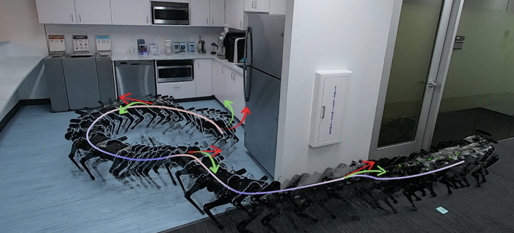

# Sim-to-Lab-to-Real
Sim-to-Lab-to-Real: Safe Reinforcement Learning with Shielding and Generalization Guarantees



[[Webpage]](https://SafeRoboticsLab.github.io/SimLabReal) | [[Paper]](https://www.sciencedirect.com/science/article/abs/pii/S0004370222001515) | [[arXiv]](https://arxiv.org/abs/2201.08355)

[Kai-Chieh Hsu](https://kaichiehhsu.github.io/)<sup>1</sup>,
[Allen Z. Ren](https://allenzren.github.io/)<sup>1</sup>,
[Duy Phuong Nguyen](https://www.linkedin.com/in/buzinguyen/),
[Anirudha Majumdar](https://irom-lab.princeton.edu/majumdar/)<sup>2</sup>,
[Jaime F. Fisac](https://saferobotics.princeton.edu/jaime)<sup>2</sup>

<sup>1</sup>equal contribution in alphabetical order
<sup>2</sup>equal advising

Princeton University, Artificial Intelligence Journal (AIJ), January 2023

Please raise an issue or reach out at kaichieh or allen dot ren at princenton dot edu if you need help with running the code.

## Installation

Install the conda environment with dependencies (tested with Ubuntu 20.04):
```console
conda env create -f environment_linux.yml
pip install -e .
```

## Usage

### Running experiments for the Vanilla settings
1. Generates the dataset using the following commands
    + vanilla-normal
        ```console
        python data/process/vanilla/gen_normal.py
        ```
    + vanilla-task
        ```console
        python data/process/vanilla/gen_lab_task.py -sf <src_folder> -tf <tar_folder> 
        ```
    + vanilla-dynamics
        ```console
        python data/process/vanilla/gen_lab_task.py -sf <src_folder> -tf <tar_folder>  -p -xpl 0.3 0.5 -xpu 0.8 1.0
        ```
2. All sim and lab training configuration files are provided in [config/vanilla](./config/vanilla). Note you would need to update the paths to the policy models and datasets in the config file.
    + run sim and lab training for PAC-Perf method with the following commands.
        ```console
        python script/sim_prior.py -cf config/vanilla/sim_pac_perf.yaml
        python script/sim_posterior.py -cf config/vanilla/lab_pac_perf.yaml
        ```
    + run sim and lab training for Base method with the following commands.
        ```console
        python script/sim_naive_rl.py -cf config/vanilla/sim_base.yaml
        python script/sim_naive_rl.py -cf config/vanilla/lab_base.yaml
        ```

### Running experiments for the Advanced settings

1. Please follow the instructions [here](./data/process/advanced/README.md) to generate the environments using 3D-FRONT dataset.
2. All sim and lab training configuration files are provided in [config/advanced](./config/advanced). For example, run sim and lab training for PAC-Perf method with the following commands. Note you would need to update the paths to the policy models and datasets in the config file.
    ```console
    python script/sim_prior.py -cf config/advanced/dense/sim_pac_perf.yaml
    ```
    ```console
    python script/sim_posterior.py -cf config/advanced/realistic/lab_pac_perf.yaml
    ```
3. We recommend using at least 80GB of RAM for Advanced-Dense and Advanced-Realistic training. The runtime also largely depends on (1) the number of CPU threads used for parallelized environments, and (2) whether using a GPU for policy training.

### Evaluating pre-trained models / Visualizing environments
We highly recommend trying out the visualization scripts to get a sense of the environments and policies before running any policy training.

You can visualize the Vanilla environments using pre-trained policies with:
```console
python script/test_vanilla.py -cf config/vanilla/test_pac_perf.yaml
```

You can visualize the Advanced Dense and Realistic environments using pre-trained policies with:
```console
python script/test_advanced_dense.py -cf config/advanced/test_dense.yaml
```
```console
python script/test_advanced_realistic.py -cf config/advanced/test_reliastic.yaml
```

## Citation 

If you find our paper or code useful, please consider citing us with:
```
@article{hsuren2022slr,
title = {Sim-to-Lab-to-Real: Safe Reinforcement Learning with Shielding and Generalization Guarantees},
journal = {Artificial Intelligence},
pages = {103811},
year = {2022},
issn = {0004-3702},
doi = {https://doi.org/10.1016/j.artint.2022.103811},
author = {Kai-Chieh Hsu and Allen Z. Ren and Duy P. Nguyen and Anirudha Majumdar and Jaime F. Fisac},
}
```
